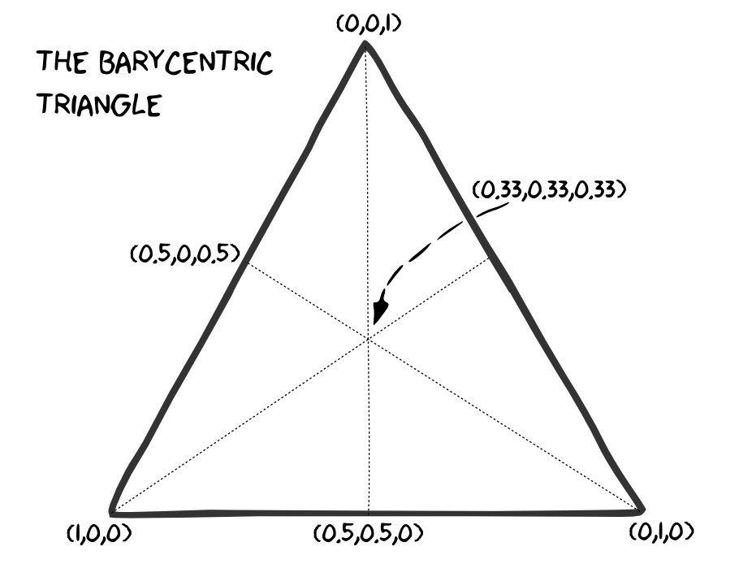

## Christoph Safferling

- Contact:
  - Twitter: [@safferli](https://twitter.com/safferli) 
  - LinkedIn: https://www.linkedin.com/in/safferling 
- since 2012: Head of Game Analytics at Blue Byte
- PhD in economics: [Three Essays on the Economics of Online Games]
  (http://kops.uni-konstanz.de/handle/123456789/17259?locale-attribute=en)
- research specialties: personnel economics, incentive theory, industrial organisation
- academic papers available at [repec.org](https://ideas.repec.org/f/psa961.html)
- this talk on github: https://github.com/safferli/datascientist_personneleconomics/tree/gabi2015

--- &vertical

## Data Scientists

> [A data scientist is] a high-ranking professional with the training and 
> curiosity to make discoveries in the world of big data.

Data Scientist: the sexiest job of the 21st century, 
[Harvard Business Review, Oct 2012]
(https://hbr.org/2012/10/data-scientist-the-sexiest-job-of-the-21st-century/)

***

***

--- &vertical

## How do you get Data Scientists?

- be international
- recruit young talent
- offer an interesting challenge

***

### Be International!

<!-- ugly hack: align the text to the flags, rather than the other way round -->

<table class="center">
<tr>
<th></th>
<th></th>
</tr>
<tr>
<td class="mytd">Chinese</td>
<td class="mytd"></td>
<td class="mytd">German</td>
<td class="mytd"></td>
</tr>
<tr>
<td class="mytd">Russian</td>
<td class="mytd"></td>
<td class="mytd">Ukranian</td>
<td class="mytd"></td>
</tr>
<tr>
<td class="mytd">Japanese</td>
<td class="mytd"></td>
<td class="mytd">Canadian</td>
<td class="mytd"></td>
</table>

*** 

### Recruit Young Talent

- many universities now offer data science specialisations
- train your own analysts 
- neccessity: there aren't many data scientists available! 

***

### Offer a challenge

- analysts want to learn, and apply their knowledge
- analysts dread boring work -- that's what scripts are for
- no platitudes, don't exaggerate, don't lie!

<!--
- these are smart people, who will have a good overview of everything that your company is doing (they're crunching the data!). Don't try to fool them, you'll fail. 
-->

--- &vertical

## How do you retain Data Scientists? 

<!-- have a good work environment -->

- pay them enough
- give them the tools, time, and opportunities to do their job 
- let them make a difference 
- give them the feeling of competence 

<!-- autonomy -->
<!-- importance -->
<!-- competence -->

***

### pay them enough

<!--
pay is not important
-->

***

### autonomy

<!--
letting them grow professionally
-->

*** 

### make a difference

<!--

-->

*** 
### competence

<!--
become a master in their field of specialisation
-->

---

### Conclusion

- have an interesting work environment
- treat analysts as smart people
- keep and encourage their sense of wonder and excitement
- reign in and direct their sense of wonder and excitement!

---

## Thank you

&hellip;and we're hiring! &#9786; 

<!-- &#128522; &#128512; -->

christoph.safferling@ubisoft.com

